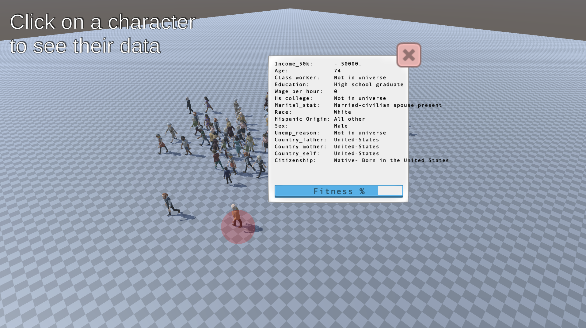
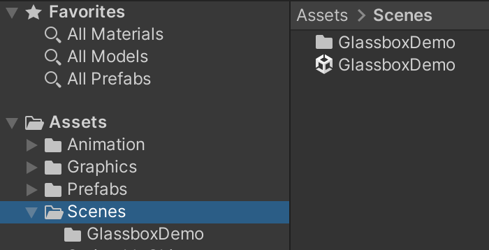
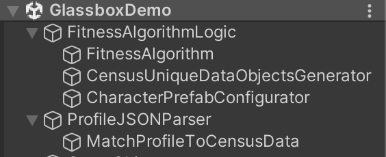
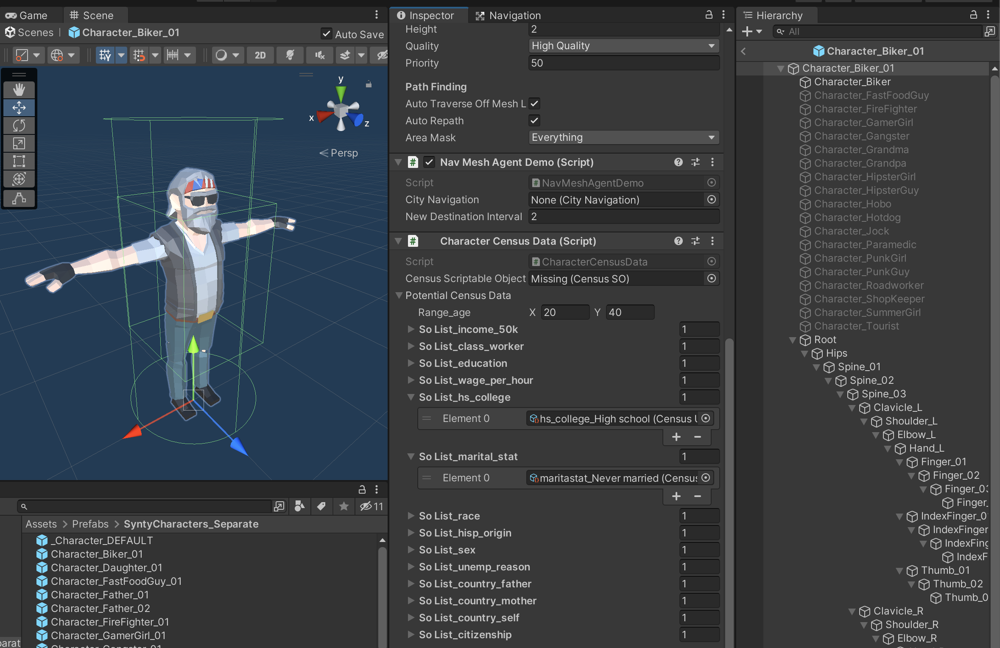
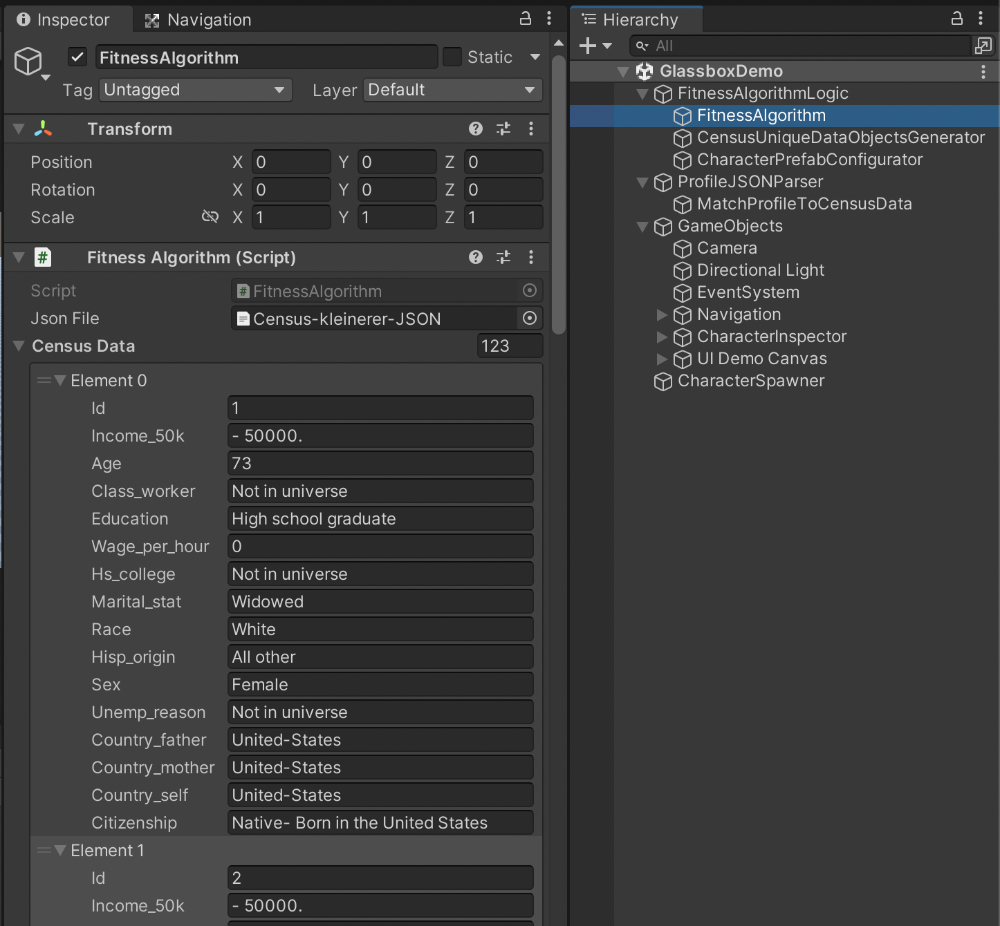
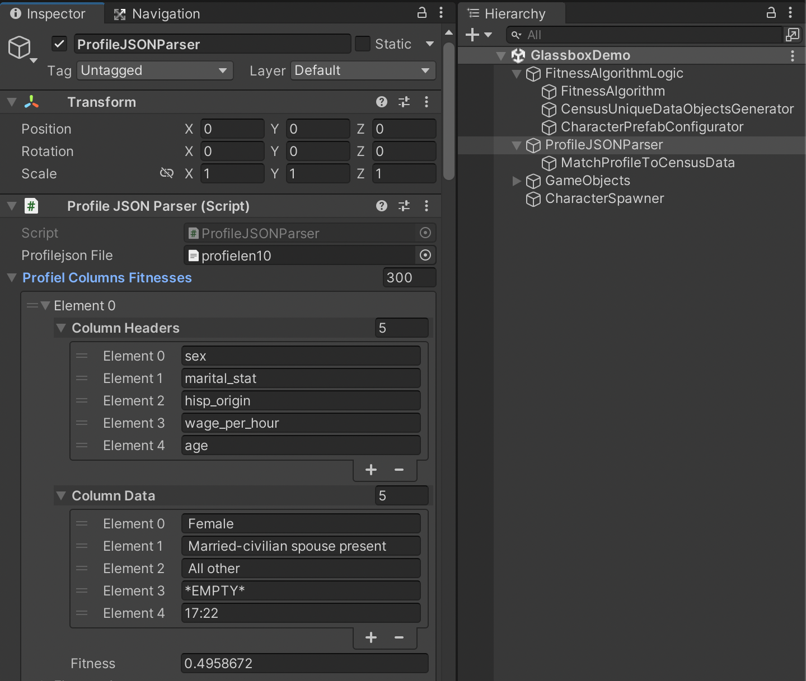
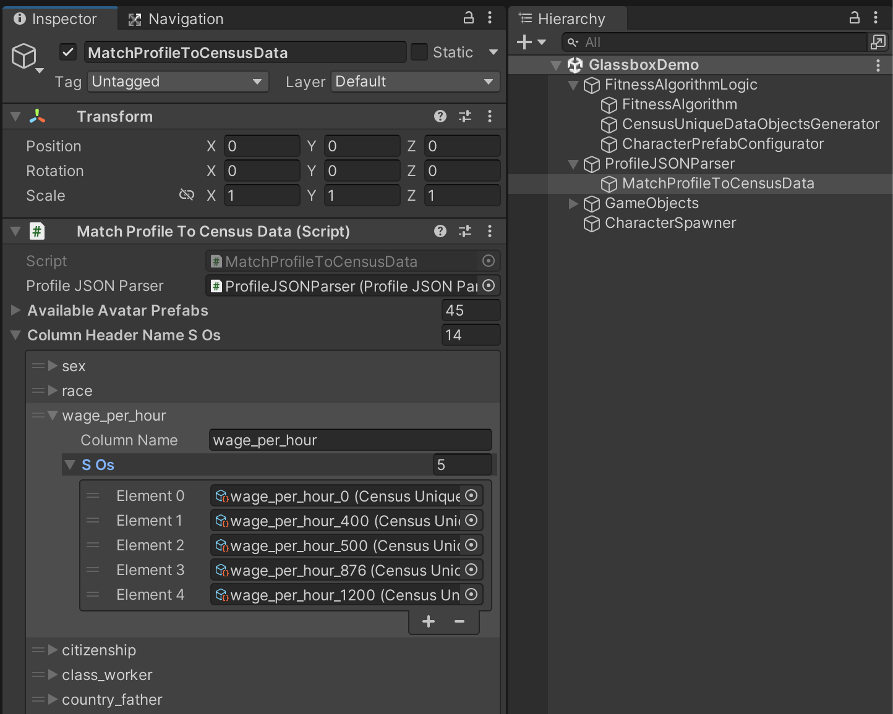

# Glassbox Unity Demo

## Get started

Open the GlassboxDemo.unity scene in the Assets->Scenes folder

---

## Scripts

Scripts are located as separate objects in the scene's Hierarchy, ranked by order of process (from first processing JSON files to finally creating Unity objects)

---
## Character Data

All the prefabs in the Assets->Prefabs->SyntyCharacters_Separate folder have a component/script called "CharacterCensusData", which have preconfigured data per character, somewhat matching their characteristics, allowing for avatars to be generated using this data.

---
## Fitness Algorithm

The FitnessAlgorithm script converts a JSON file with all availble census data into classes with strings, sorts the data by category, and filters them to show only unique entries

---
## JSON Parser

ProfileJSONParser converts a profiles JSON file into classes and categories that match the census data's categories.

---

## Match Profile To Census (unfinished)

This work in progress system should check the profile data, and come up with the closest resembling avatar (based on the prefab's data, see "Character Data" above) to generate.

---
